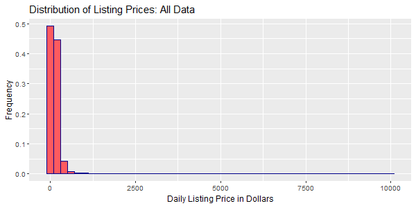
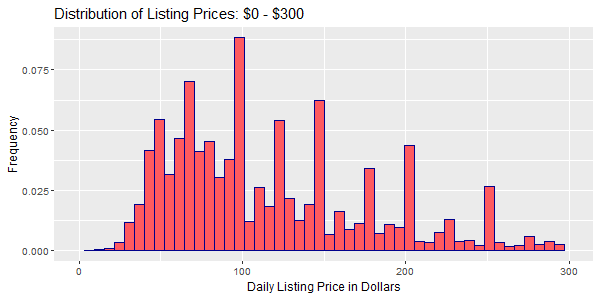
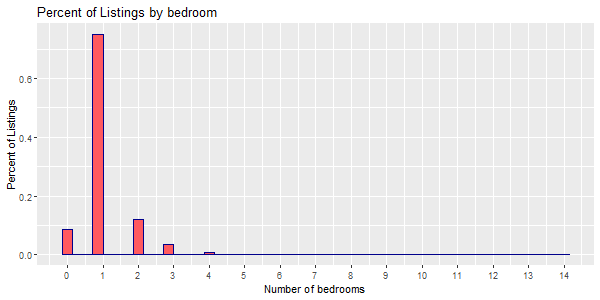

## [Overview](../index.md)

# Data Exploration

## [Preprocessing](../preprocessing/cleaning.md)

## [Feature Creation](../feature_creation/features.md)

## [Model Building](../model_building/model.md)

## [Conclusion](../conclusion/conclusion.md)

### Exploring Listings Data

```R
library(data.table)
library(dplyr)
library(ggplot2)
library(stringr)
library(ggmap)
library(sp)
library(corrplot)
library(GGally)

red_col= '#FF5A5F'
df1= fread(.../listings_dec.csv")
df2= fread(".../listings_sep.csv")

df2=df2 %>% 
  select(-is_business_travel_ready)
df= rbind(df1, df2)
df=unique(df)

df$price= gsub("[^0-9\\.]","",df$price)
df$price= as.numeric(df$price)

df$price_bin= as.factor(ifelse(df$price %in% 0:100,1,
                               ifelse(df$price %in% 101:300,2,
                                      3)))
ggplot(df, aes(x=price)) + geom_histogram(aes(y=..count../sum(..count..)),
                                          color="darkblue", fill=red_col,bins = 50)+
                          labs(x='Daily Listing Price in Dollars', y='Frequency', title='Distribution of Listing Prices: All Data')
```



```R
ggplot(df, aes(x=price)) + geom_histogram(aes(y=..count../sum(..count..)),
                                          color="darkblue", fill=red_col,bins = 50)+ xlim(0,1000)+
  labs(x='Daily Listing Price in Dollars', y='Frequency', title='Distribution of Listing Prices: $0 - $1000')

```


```R
ggplot(df, aes(x=price)) + geom_histogram(aes(y=..count../sum(..count..)),
                                          color="darkblue", fill=red_col,bins = 50)+ xlim(0,300)+
  labs(x='Daily Listing Price in Dollars', y='Frequency', title='Distribution of Listing Prices: $0 - $300')
```


```R
ggplot(df, aes(x=bedrooms)) + geom_histogram(aes(y=..count../sum(..count..)),
                                             color="darkblue", fill=red_col, bins = 50)+ 
  scale_x_continuous(labels=c(0:15), breaks = c(0:15))+
  labs(x='Number of bedrooms', y='Percent of Listings', title='Percent of Listings by bedroom')

```

```R
lat <- c(40.5,40.95)
long <- c(-74.2,-73.7)
bbox <- make_bbox(long,lat,f=0.05)
b <- get_map(bbox,maptype="terrain",source="stamen")

ggmap(b)+ geom_point(data = df, aes(x = longitude, y = latitude,
                                    color = price_bin), 
                     size = 1.5, show.legend = TRUE)+ labs(title='NYC Airbnb Listings', x= 'Longitude', y='Latitude')+
                      scale_color_manual(name="Price", 
                                         labels = c("0-100", 
                                                    "100-300", 
                                                    "300+"), 
                                         values = c("1"="cyan3", 
                                                    "2"="blue", 
                                                    "3"="red"))
```

