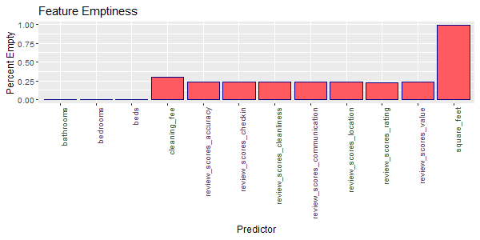
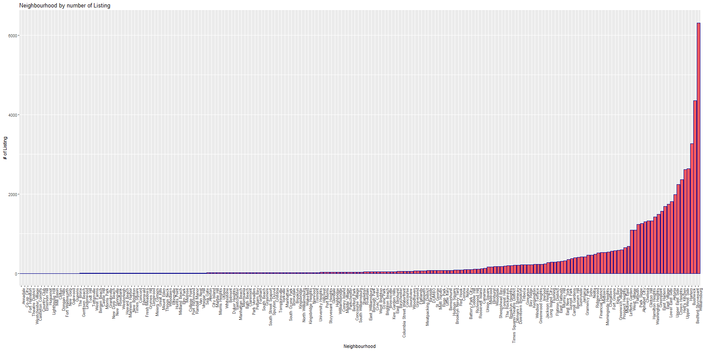
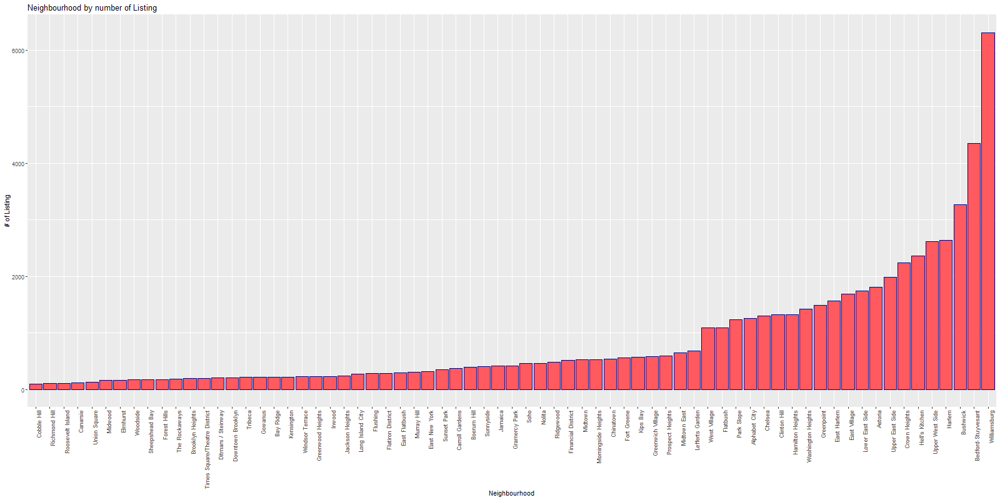
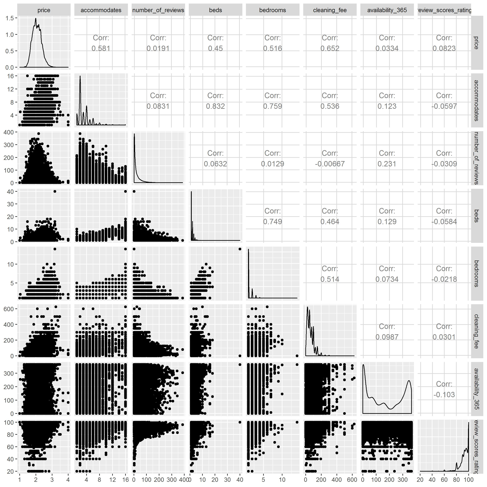
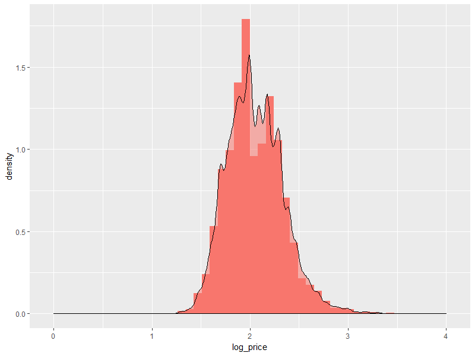

## [Overview](../index.md)

## [Data Exploration](../data_exploration/exploration.md)

# Preprocessing

## [Feature Creation](../feature_creation/features.md)

## [Model Building](../model_building/model.md)

## [Conclusion](../conclusion/conclusion.md)

### Cleaning and Preprocessing Airbnb Data
Now that we have a good understanding of what our data looks like, the Airbnb datasets provided need to be cleaned and edited for optimal model usage. This includes performing initial feature selection, imputing missing data, examining collinearity, performing variable transformations, and further pre-processing.

### Import Libraries


```R
library(data.table)
library(dplyr)
library(ggplot2)
library(stringr)
library(ggmap)
library(sp)
library(corrplot)
library(GGally)
```

### Initial Feature Selection
As a baseline, we can start by removing features that we intuitively sense will not be of great importance to a listing's price. These can be further explored later, if need be. This includes 18 features:

* `scrape_id`: Not related to actual property data.
* `last_scraped`: All within first three days of January, not related to actual property data.
* `picture_url`: Could perform visual analysis and mentioned in 'Further Exploration' in the overview. We, however, will not do that. 
* `host_id`: Ties a host to the property; high unique count makes it unattractive to use.
* `host_name`: Not related to actual property data; no textual importance.
* `host_since`: Not specific to the listing - arguable how it can be a beneficial feature; no textual importance.
* `host_picture_url`: Irrelevant to property data; could perform visual analysis.
* `street`: Generic names; location data captured with lower unique count in other geographical features.
* `neighbourhood`: The `neighbourhood_cleansed` feature presents the same data in a better format.
* `state`: All listings are in the state of NY - this is useless. We clean before removing this feature just in case.
* `market`: All listings should be in the NY market - this is useless. 
* `country`: All listings are in the USA - this is useless.
* `weekly_price`: Function of daily price - should not be a predictor.
* `monthly_price`: Function of daily price - should not be a predictor.
* `calendar_updated`: Does not say much about the property data.
* `calendar_last_scraped`: All within first three days of January, irrelevant to actual property data.
* `first_review`: Time irrelevant to property data, high unique count.
* `last_review`: Time irrelevant to property data, high unique count.


```R

df=df[,c('id', 'name' ,'host_id',
         'neighbourhood',
         'neighbourhood_cleansed' ,'city', 'zipcode' ,
         'latitude' ,'longitude', 'is_location_exact' ,'property_type' ,'room_type',
         'accommodates' ,'bathrooms', 'bedrooms', 'beds' ,'bed_type', 'square_feet',
         'price','guests_included', 'extra_people',
         'minimum_nights' ,'maximum_nights' , 'cleaning_fee','availability_30',
         'availability_60', 'availability_90' ,'availability_365',
         'number_of_reviews' ,
         'review_scores_rating', 'review_scores_accuracy',
         'review_scores_cleanliness', 'review_scores_checkin',
         'review_scores_communication', 'review_scores_location',
         'review_scores_value' ,'picture_url', 'price_bin', 'street')]
         
df$cleaning_fee= gsub("[^0-9\\.]","",df$cleaning_fee)
df$cleaning_fee= as.numeric(df$cleaning_fee)

head(df)
```

<div>
<table border="1" class="dataframe">
  <thead>
    <tr style="text-align: right;">
      <th></th>
      <th>id</th>
      <th>name</th>
      <th>...</th>
      <th>review_scores_value</th>
      <th>host_listing_count</th>
    </tr>
  </thead>
  <tbody>
    <tr>
      <th>0</th>
      <td>1069266</td>
      <td>Stay like a real New Yorker!</td>
      <td>...</td>
      <td>9.0</td>
      <td>1</td>
    </tr>
    <tr>
      <th>1</th>
      <td>1846722</td>
      <td>Apartment 20 Minutes Times Square</td>
      <td>...</td>
      <td>8.0</td>
      <td>2</td>
    </tr>
    <tr>
      <th>2</th>
      <td>2061725</td>
      <td>Option of 2 Beds w Private Bathroom</td>
      <td>...</td>
      <td>10.0</td>
      <td>4</td>
    </tr>
  </tbody>
</table>
<p>3 rows × 33 columns</p>
</div>


### Feature Emptiness and Initial Cleaning

Before imputing missing values, we should examine the percentage of values that are missing from each feature. Imputing data for a feature with too much missing data can bias the model.


```R
x= data.frame(sort(colSums(sapply(df, is.na)), decreasing = TRUE))
names(x)[1]= 'values_missing'

x['feature']= rownames(x)
x['perc_missing']= x['values_missing']/nrow(df)
x= subset(x, perc_missing>0)

ggplot(x, aes(x=feature,y=perc_missing))+ geom_bar(stat='identity',color='darkblue', fill=red_col)+
  theme(axis.text.x = element_text(angle = 90, hjust = 1))+ labs(x= 'Predictor', y='Percent Empty', title= 'Feature Emptiness')

```



The percent emptiness graph shows that `square_feet` is over 90% empty. This is too empty for imputation, so we remove this feature.


```R
df= df %>% 
  select(-square_feet)
```

We need to also make sure making sure that all quantitative predictors and response variables are float. This will allow us to better deal with categorical data, and NaN entries in the float data.

#### Erroneous Entries
We also remove entries (listings) that have faulty data such as:

* There are 0 bedrooms
* There are 0 bathrooms
* There are 0 beds
* Price is $0

```R
# List of columns to be converted to floating point
df$accommodates= as.integer(df$accommodates)
df$bathrooms= as.integer(df$accommodates)
```
#### Removing Erroneous Entries
```R
df= subset(df, bedrooms!=0)
df= subset(df, beds!=0)
df= subset(df, bathrooms!=0)            
df= subset(df, price!=0)
```


#### Trimming Neighborhood Entries
When we explored our data we saw that geography was very important to pricing, especially on Manhattan. The `neighbourhood_cleansed` feature could therefore be important. Looking at the distribution below we notice it is heavily left-skewed.


```R
df_neighbour= df %>% 
  group_by(neighbourhood) %>% 
  tally() %>% 
  filter(neighbourhood!='') %>% 
  rename(count=n)
df_neighbour= df_neighbour[order(df_neighbour$count),]
df_neighbour=df_neighbour[-c(12),]

ggplot(df_neighbour, aes(x= reorder(neighbourhood, count), y=count))+ geom_bar(stat='identity',color='darkblue', fill=red_col)+
  theme(axis.text.x = element_text(angle = 90, hjust = 1))+
  labs(x='Neighbourhood',y='# of Listing', title='Neighbourhood by number of Listing')

```



    Number of Neighborhoods: 186


We see that the majority of the neighborhoods have less than 100 listings. We currently have 186 neighborhoods - all of these categorical predictors when one-hot encoded will weaken predictive power, so we will only keep neighborhoods with more than 100 listings.


```R
df_neighbour2= subset(df_neighbour, count>100)
ggplot(df_neighbour2, aes(x= reorder(neighbourhood, count), y=count))+ geom_bar(stat='identity',color='darkblue', fill=red_col)+
  theme(axis.text.x = element_text(angle = 90, hjust = 1))+
  labs(x='Neighbourhood',y='# of Listing', title='Neighbourhood by number of Listing')

```





    Number of entries removed:  2372


### Multicollinearity and More Preprocessing 
Looking through `zipcode` and `city` we realize that there is a lot of erroneous and incomplete data in these features. We will likely remove these features, but will examine multicollinearity to see how much is captured by other geographical features comparably. Before doing so, we need to deal with our missing values. To examine multicollinearity, we will temporarily drop all NaN values and label encode our data.


```R

df_num= select_if(df_1, is.numeric)
df_num= df_num %>% 
  select(-host_id)
 df_num= df_num[,c('price', 'accommodates','number_of_reviews', 'beds', 'bedrooms','cleaning_fee','availability_30', 'review_scores_rating')]
 
 ggpairs(df_num)
```



After inspecting the data, we notice that `zipcode` and `city` are very correlated to each other - and both are also fairly correlated to latitude and longitude. Since these features are very messy, and have a high count of uniques (180+ for each) we will remove them. We also notice that the availability features (`availability_30`, `availability_60`, `availability_90`, and `availability_365`) are all highly correlated. We remove all but `availability_365`, as it is the least correlated to the other features.


```python
# Unsuppress Output
pd.options.display.max_columns = 5
pd.options.display.max_rows = 5
corr_df
```


<div>
<table border="1" class="dataframe">
  <thead>
    <tr style="text-align: right;">
      <th></th>
      <th>id</th>
      <th>name</th>
      <th>...</th>
      <th>host_listing_count</th>
      <th>price</th>
    </tr>
  </thead>
  <tbody>
    <tr>
      <th>id</th>
      <td>1.000000</td>
      <td>0.000507</td>
      <td>...</td>
      <td>0.022666</td>
      <td>-0.047687</td>
    </tr>
    <tr>
      <th>name</th>
      <td>0.000507</td>
      <td>1.000000</td>
      <td>...</td>
      <td>0.041064</td>
      <td>-0.037688</td>
    </tr>
    <tr>
      <th>...</th>
      <td>...</td>
      <td>...</td>
      <td>...</td>
      <td>...</td>
      <td>...</td>
    </tr>
    <tr>
      <th>host_listing_count</th>
      <td>0.022666</td>
      <td>0.041064</td>
      <td>...</td>
      <td>1.000000</td>
      <td>-0.076214</td>
    </tr>
    <tr>
      <th>price</th>
      <td>-0.047687</td>
      <td>-0.037688</td>
      <td>...</td>
      <td>-0.076214</td>
      <td>1.000000</td>
    </tr>
  </tbody>
</table>
<p>33 rows × 33 columns</p>
</div>


#### Imputation on Missing Values

#### Log Transformation of Target Variable


